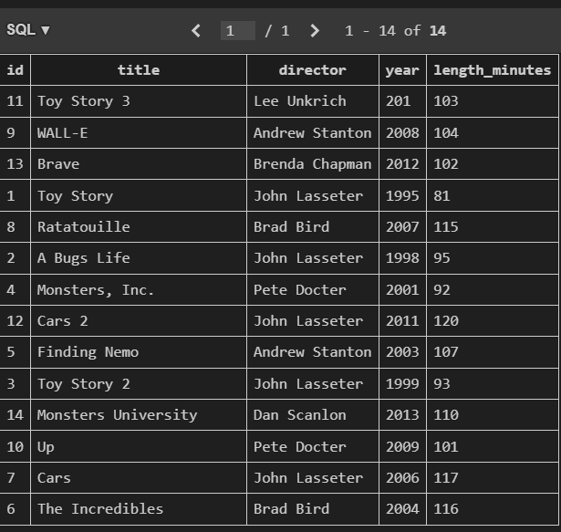

# [SQL Lesson 4: Filtering and sorting Query results](https://sqlbolt.com/lesson/filtering_sorting_query_results)

## Problem Statement

Let's say I want the set of all directors. So how can I query that? We have seen the `SELECT` clause where we can select the director column, but then that is going to give us a raw response containing duplicates. This is where the `DISTINCT` comes into play.  SQL provides a convenient way to discard rows that have a duplicate column value by using the `DISTINCT` keyword.

``` sql
SELECT DISTINCT column, another_column, …
FROM mytable
WHERE condition(s);
```

In addition to selecting `DISTINCT` rows, we can also use the `ORDER BY` clause to arrange the data in ascending or desending order so it is more convineint for us to read it.

``` sql
SELECT DISTINCT column, another_column, …
FROM mytable
WHERE condition(s);
ORDER BY column ASC/DESC;
```

When an `ORDER BY` clause is specified, each row is sorted alpha-numerically based on the specified column's value.

Now, we have a nice way to remove duplicates, and a nice way to order the results. We can add yet another clause to even refine our search.
We can use `LIMIT` and `OFFSET` clauses to further fine tune the part of the result we are super interested in. The `LIMIT` will reduce the number of rows to return, and the optional `OFFSET` will specify where to begin counting the number rows from.

``` sql
SELECT column, another_column, …
FROM mytable
WHERE condition(s)
ORDER BY column ASC/DESC
LIMIT num_limit OFFSET num_offset;
```

So from I understand it makes sense to use them with `ORDER BY`. Basically, we order the results to our liking, and then we go thru it bit by bit. A good way to think about this is Reddit. So basically it must be `ORDER BY` some KPI (Ex. most likes) and limited to lets say 50 results.

## Tasks    

1. List all directors of Pixar movies (alphabetically), without duplicates
2. List the last four Pixar movies released (ordered from most recent to least)
3. List the first five Pixar movies sorted alphabetically
4. List the next five Pixar movies sorted alphabetically

We'll use the `shuffled_movies` table from the [`sqlbolt_movies.db`](../databases/sqlbolt_movies.db) database for this exerise. This is how the table looks like




### 1. List all directors of Pixar movies (alphabetically), without duplicates
```
SELECT DISTINCT director     
FROM shuffled_movies
ORDER BY director;
```
### 2. List the last four Pixar movies released (ordered from most recent to least)
```
SELECT title     
FROM shuffled_movies
ORDER BY year DESC
LIMIT 4;
```
### 3. List the first five Pixar movies sorted alphabetically
```
SELECT title     
FROM shuffled_movies
ORDER BY title ASC
LIMIT 5;
```
### 4. List the next five Pixar movies sorted alphabetically
```
SELECT title     
FROM shuffled_movies
ORDER BY title ASC
LIMIT 5 OFFSET 5;
```